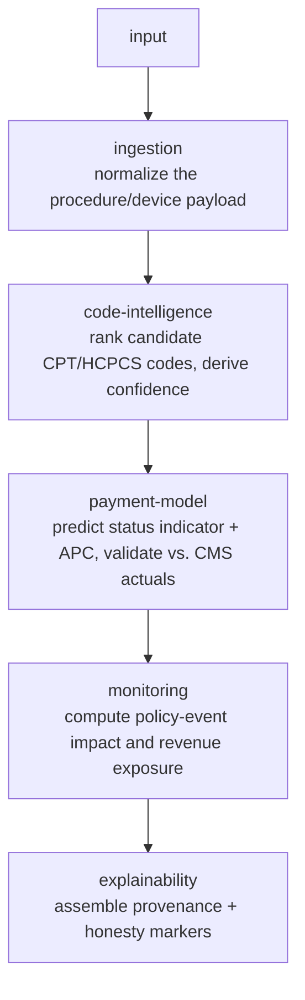

# CPT Reimbursement Engine

**A device can clear the FDA, hold a valid CPT code, and still earn $0.** Whether it gets paid at all comes down to a Medicare OPPS status indicator. It is a detail that lives downstream of the code, invisible to most tooling that stops at "is there a code for this?" This engine doesn't stop there. It maps a procedure or device to its codes, predicts the *payment outcome*, and surfaces the failure modes that turn a covered code into no revenue.

The gap between **coded** and **paid** is the problem this closes.

---

## The idea

Most reimbursement tooling answers "does a code exist?" That's the easy question, and it's the wrong one. A code can exist and pay nothing. A code can be right and sit in the wrong payment tier. A pass-through code can pay well until the day it expires off a cliff. The hard question, the one that decides whether a medical-device company has a business, is *will this actually get paid, and where will it fail?*

I built this engine to answer that question deterministically, with every output carrying its own evidence.

## Design principles

Three decisions shaped the build, and they're the part I'd defend in a review:

- **Computed, never hardcoded.** Every material output (code ranking, confidence, payment prediction, CMS validation) is produced by the engine at runtime from the input and the dataset. Nothing is a scenario literal dressed up as a result. If the engine can't show its work, it doesn't emit the answer.
- **Honesty markers on everything.** Each output is tagged `computed`, `sourced`, or `simulated`, and carries a provenance trail. A reviewer can see exactly which fields are real engine output, which come from sourced data, and which are demonstration inputs. No mixed-truth presentations.
- **Abstain over guess.** Confidence is derived from three weighted contributors against a floor and a review threshold: descriptor match (0.55), keyword overlap (0.30), category alignment (0.15). Low-signal input doesn't get a confident-looking wrong answer; it routes to specialist review. The engine is built to say "I don't know" rather than fabricate certainty.

That last one is the whole philosophy: in a domain where a wrong payment prediction costs a company real money, calibrated uncertainty beats confident error.

## Architecture

**One engine, two surfaces.** A dependency-free TypeScript core (`app/lib/demo/`) performs all computation. Both an API surface (`app/api/`) and a clickable demo UI (`app/components/demo/`) consume the same engine outputs. No logic lives in the UI that could diverge from engine behavior. The engine is the single source of truth; the surfaces only render it.
For the full design rationale, see [ARCHITECTURE.md](./ARCHITECTURE.md).

The core is five service modules over one pipeline:


A provider seam (`CodeDataProvider`, `PolicyFeedProvider`) abstracts data access behind interfaces, so a license-backed data source can be swapped in without touching engine logic.

## The five failure modes

The demo walks five ways reimbursement breaks, each anchored to a real code and validated against CMS actuals:

| Failure mode | What breaks | Anchor |
|---|---|---|
| **Status-indicator failure** | Code exists, pays $0 | Extended external ECG monitoring, status E1 |
| **APC misalignment** | Right code, wrong payment tier | CPT 0733T |
| **Pass-through cliff** | Payment collapses at expiration | RECELL — C1832 / CPT 15013 |
| **No-precedent** | No coding pathway exists at all | Implantable neural-interface archetype |
| **Coverage boundary** | Device-intensive, on the edge of coverage | Cochlear implant, CPT 69930 |

Each prediction is checked against stored CMS values, so the engine isn't just asserting an outcome — it's validating its own answer against ground truth.

## Real vs. stubbed

I hold a hard line between what the engine computes and what stands in for a licensed or live source. Stating this plainly is the point, not a disclaimer:

| Area | Status | Notes |
|---|---|---|
| Engine, scoring, payment prediction, CMS validation | **Real** | Tested runtime pipeline and API routes |
| Curated code dataset | **Real** | Sourced to CY2025 OPPS addenda (A, B, P), provenance per code |
| AMA-licensed data provider | **Stubbed** | Placeholder behind a stable interface until a license is confirmed |
| Policy feed | **Seeded / simulated** | Seeded events explicitly marked as simulated inputs |
| Procedure-volume economics | **Modeling assumption** | Labeled as an assumption, not sourced |

## Run it

```bash
npm install
npm run dev      # http://localhost:3000 — the clickable demo
npm test         # engine + pipeline + route tests
```

Tests run under Vitest against the pure-TypeScript engine: **49 tests across 9 files**. The suite validates each scenario's prediction against stored CMS actuals and confirms confidence is computed and varies with input. That is, it checks that the engine is reasoning, not returning canned answers.

## Scope and limitations

This is a demonstration engine over a curated CY2025 OPPS dataset, built to prove the reasoning and the architecture — not a production reimbursement system. Stating the boundary precisely is part of the design:

- **Curated dataset, not live data.** The code dataset is hand-sourced to CY2025 OPPS addenda with per-code provenance. Production would require the licensed AMA data provider (stubbed here behind a stable interface) and a live CMS policy feed (seeded/simulated here).
- **Five anchored failure modes, not exhaustive coverage.** The five scenarios are real, validated against CMS actuals, and chosen to cover distinct failure classes. They demonstrate the pattern; they are not the full space of reimbursement outcomes.
- **Confidence is calibrated, not learned.** The scoring weights and thresholds are deterministic and hand-tuned against the curated set, by design — the engine's value here is auditable, explainable reasoning, not a trained model. A production version could layer a learned ranker behind the same provider seam without changing the contract.
- **Economic figures are modeling assumptions.** Procedure-volume and revenue-exposure numbers are labeled assumptions, not sourced estimates.
- **Known dev-dependency advisory.** `npm audit` reports one remaining moderate advisory: a `postcss` CSS-stringify XSS issue, pulled in transitively through the Next.js build dependency. It concerns CSS output handling in a deployed build serving untrusted input. This repository is a local demonstration run via `npm run dev` or the headless `npm run demo` against curated inputs, with no deployment and no untrusted request path, so the exposure is out of scope here. The only resolver-offered fix is a forced, out-of-range Next.js version change (`npm audit fix --force`), which is deliberately not applied so the build stays pinned and reproducible. All non-breaking advisories are patched.

What I'd build next: the licensed AMA provider behind the existing seam, a live policy feed replacing the seeded events, and an expanded validated dataset to widen scenario coverage.

## Context & attribution

I built this as my contribution to **Bursa.ai**, a graduate project at Santa Clara University (ENGR 373). All engine, service, API, and demo-interface code in this repository is my own work, verified by authorship history. Bursa.ai was a team project; the original team repository was set up by **Ali Zargari**, and **Vivek Jumde** was a project collaborator. This repository contains only my contribution.
